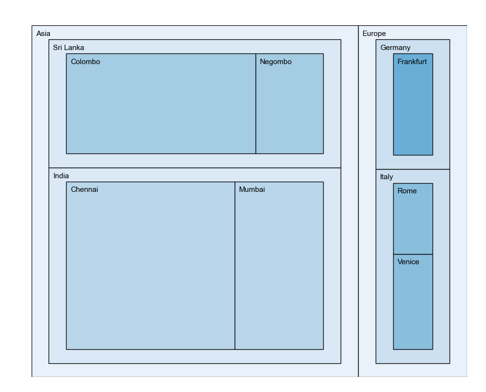
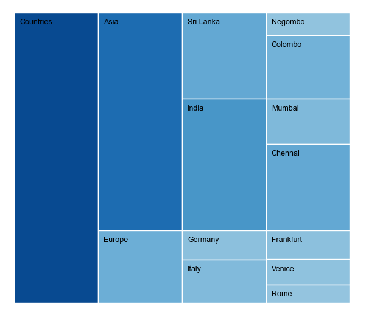
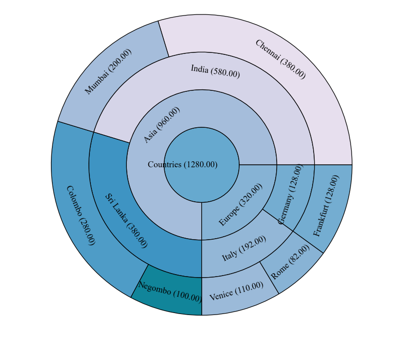

# Charts
PyCharts++ supports the following hierarchical chart types.

- [Treemap](charts.md#treemap)
- [Icicle](charts.md#icicle)
- [Suburst](charts.md#sunburst)

More information about the supported chart types are provided below.

## Treemap

Treemap represents a hierarchy using rectangles. Each rectangle corresponds to a node in the tree/hierarchy. The area of the rectangle is a representation of the value of the particular node associated with it. A treemap can be used to get an overall idea about the nodes and their values respective to the other nodes.

## Icicle

Icicle charts visualize a hierarchical data structure where rectangles are used to represent nodes of a hierarchical data set. The depth of the rectangles shows the depth of the nodes in the hierarchy they represent. The area of a rectangle depends on the value of the node itself and surrounding nodes.

## Sunburst

Sunburst represent a hierarchy using rings. Each ring corresponds to a level of the tree/hierarchy with the innermost circle as the root of the tree or top of the hierarchy and outmost circle as the leaf of the tree or bottom of the hierarchy. Each ring divides into the values of the nodes. The sunburst chart's radial layout makes efficient use of available space than the linear (horizontal or vertical) hierarchical representation. 
