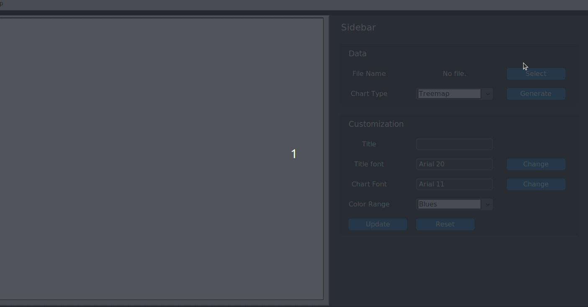
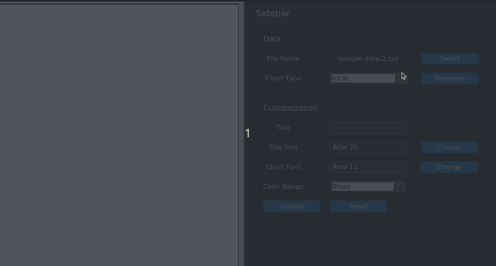
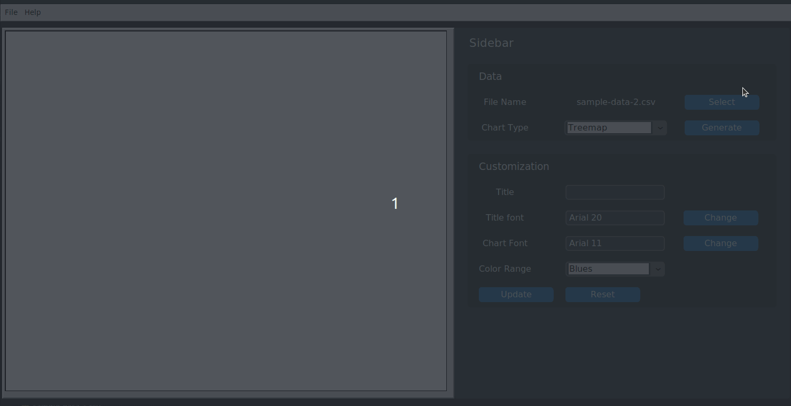

# User Guide

## Installation

## Usage

### Basic Usage
To generate a chart using PyCharts++, you need to provide a CSV data file in a pre-defined format to the program. See the [Data File Preparation]() section for more information.

You can select the data file by clicking on the _Select_ button in the _Data_ section of the _Sidebar_.

Select the _Chart Type_ from the dropdown menu.

Click _Generate_ button to generate the chart.

### Data File Preparation

### Customize Charts

### Export Charts