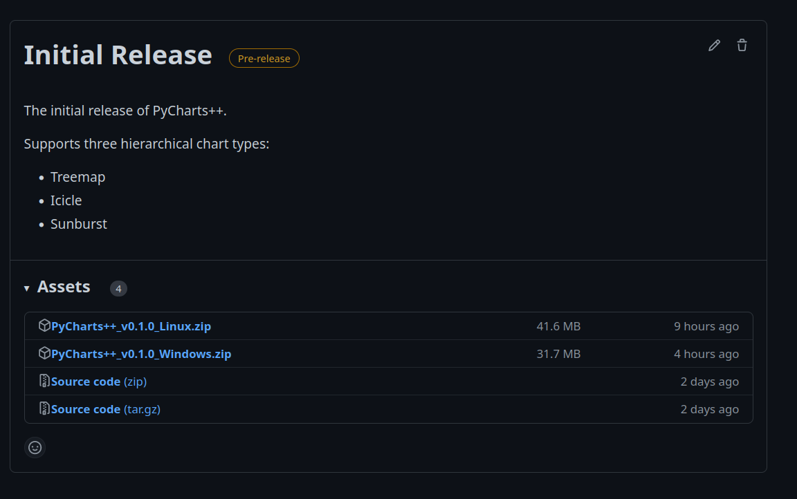
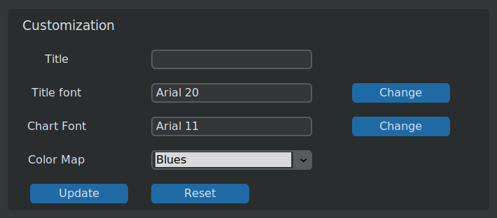
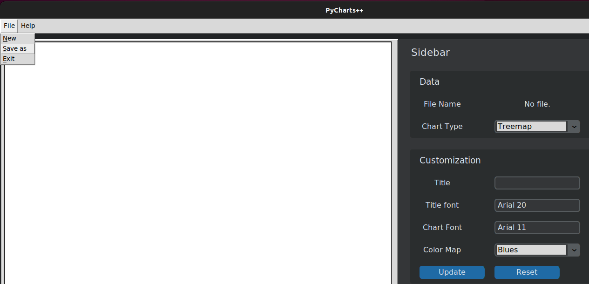

# User Guide

- [Installation](user_guide.md#installation)
- [Usage](user_guide.md#usage)
    - [Basic Usage](user_guide.md#basic-usage)
    - [Data File Preparation](user_guide.md#data-file-preparation)
- [Customize Charts](user_guide.md#customize-charts)
- [Export Charts](user_guide.md#export-charts)

## Installation
The executable software can be downloaded from the [releases page of our Github page](https://github.com/pycharts/pycharts/releases). Make sure to download the correct zip file according to your operating system.

Extract the downloaded zip file. Then run the executable file named "app" inside the app folder.


## Usage

### Basic Usage
To generate a chart using PyCharts++, you need to provide a CSV data file in a pre-defined format to the program. See the [Data File Preparation](user_guide.md#data-file-preparation) section for more information.

You can select the data file by clicking on the _Select_ button in the _Data_ section of the _Sidebar_.


Select the _Chart Type_ from the dropdown menu.


Click _Generate_ button to generate the chart.


### Data File Preparation
The input data file to PyCharts++ should be a Comma Separated Values (CSV) file.

The format of the file is as follows:

- There must be two columns named _name_, and _value_.
- Each entry in the file is a node in the hierarchy/tree.
- The name column of an entry is given such that it represents all the nodes up to that node from the root. The node names are separated by periods.
    - Example: _root.node1.node2.node3_
- The value column can be empty, an integer, or a float for a given entry. (Non-leaf nodes of the tree have empty values.)
- Whenever you use a node name inside the name of another node, that ancestor node must be defined before the new node.
    - Example: If you are entering _root.node1.node2_ as an entry, there must be a previous entry as _root.node1_.
- The name of each **node** must be unique. (Please note the term **node**.)
    - It means that if there is an entry as "_root.apple.orange.**banana**_", there cannot be an entry as "_root.apple.**banana**_".

A sample input data file is shown below.

```{.csv}
name,value
Countries,
Countries.Asia,
Countries.Asia.Sri Lanka,
Countries.Asia.Sri Lanka.Negombo,100
Countries.Asia.Sri Lanka.Colombo,280
Countries.Asia.India,
Countries.Asia.India.Mumbai,200
Countries.Asia.India.Chennai,380
Countries.Europe,
Countries.Europe.Germany,
Countries.Europe.Germany.Frankfurt,128
Countries.Europe.Italy,
Countries.Europe.Italy.Venice,110
Countries.Europe.Italy.Rome,82
```

## Customize Charts
PyCharts++ offers few options to customize the charts generated.

- Title
    - You can enter a title for the generated chart.
- Title font
    - You can set the title's font family and font size.
- Chart font
    - You can change the font family and the font size of the text inside the chart.
- Color Map
    - You can select a color map for the colors of the chart.

After setting the attributes, you need to click _Update_ to update the chart.



## Export Charts

You can export the generated charts into Portable Network Graphic (PNG) format.

To export, click _File_ from the Menu, then click _Save as_. A dialog will appear to select the location to save the output.

